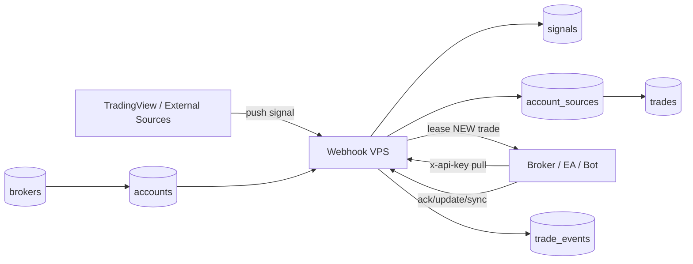
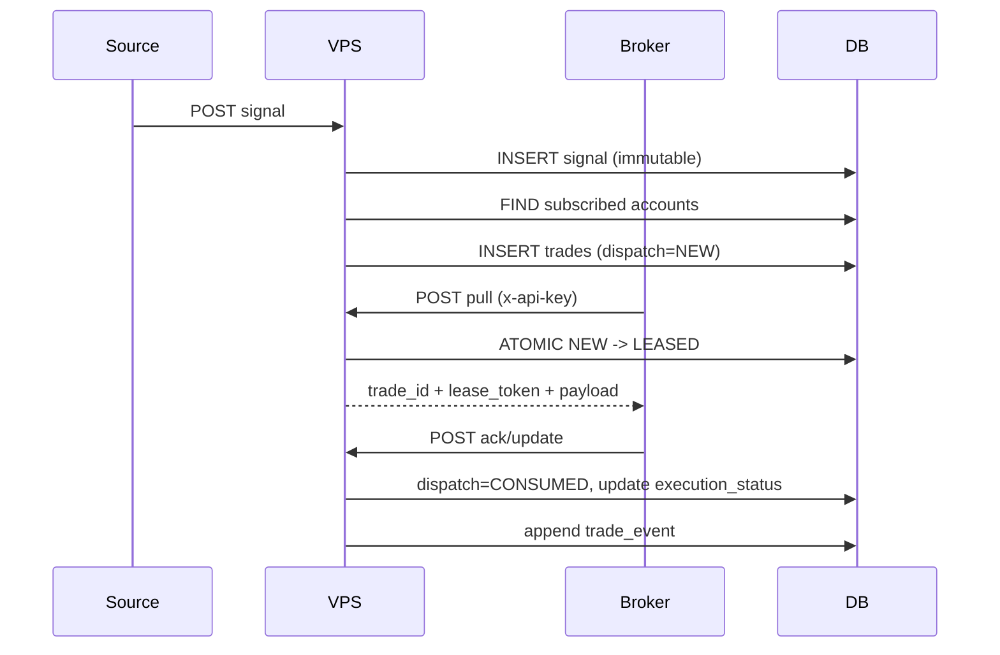
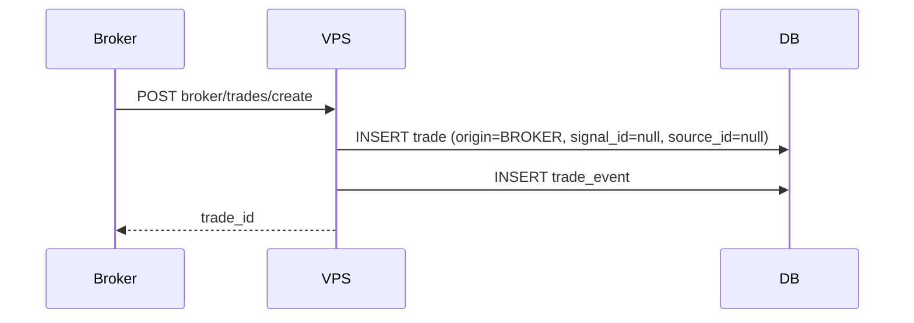

# Execution Hub V2 (Design + Contract)

Date: 2026-04-17  
Status: Phase 1 locked (schema/API/migration contracts ready)

## 0) Contract artifacts (Phase 1 output)

- SQL contract: [`EXECUTION_HUB_V2_SCHEMA.sql`](/Users/macmini/Trade/Bot/trading/docs/mt5-product/EXECUTION_HUB_V2_SCHEMA.sql)
- API contract (OpenAPI): [`EXECUTION_HUB_V2_API.yaml`](/Users/macmini/Trade/Bot/trading/docs/mt5-product/EXECUTION_HUB_V2_API.yaml)
- Migration contract: [`EXECUTION_HUB_V2_MIGRATION.md`](/Users/macmini/Trade/Bot/trading/docs/mt5-product/EXECUTION_HUB_V2_MIGRATION.md)

## 1) Answers to your questions

### 1.1 Naming / table terms
Current suggestion is good. Recommended naming to reduce ambiguity:

- `signals` -> keep as is (external market intents, immutable reference)
- `trades` -> keep as is (real account execution records)
- `sources` -> keep as is (TV/webhook/manual/bot upstream producers)
- `accounts` -> keep as is
- add `brokers` table (executor identity/runtime type)
- add `account_sources` table (subscriptions)
- remove `user_api_keys` table

### 1.2 One account to one broker (optional)?
Yes, this model is valid and simpler for operations.

- `accounts.broker_id` nullable.
- If null: account is passive/monitor-only.
- If set: exactly one active broker executor attached.

### 1.3 Clone signal -> trade at push time
Agreed. This should be the default fan-out:
- source pushes signal
- VPS resolves subscribed accounts
- VPS creates one `trade` per subscribed account with `dispatch_status='NEW'`

### 1.4 Status model is redundant today
Agreed. Replace old monolithic status cycle with a split model:
- dispatch state (queue lifecycle)
- execution state (real trade lifecycle)
- close reason (terminal classification)

### 1.5 Broker-originated trades (no signal/source)
Agreed. `signal_id` and `source_id` must be nullable for broker-native trades.

### 1.6 How to know pulled vs new per broker/account
Use per-account dispatch lease fields on `trades`:
- `dispatch_status` = `NEW | LEASED | CONSUMED`
- `lease_token`, `lease_expires_at`, `pulled_at`
- pull endpoint atomically moves `NEW -> LEASED` for that account

This gives deterministic “new or already pulled” semantics.

## 2) Domain model (refined)

### 2.1 Core entities
- `Source`: emits signals.
- `Signal`: immutable upstream intent payload.
- `Account`: trading account under user.
- `Broker`: executor process identity (EA bot, API bot, manual bridge).
- `Trade`: execution record per account, optional link to signal/source.
- `TradeEvent`: append-only audit timeline.

### 2.2 Status model (simplified)
- `dispatch_status` (queue):
  - `NEW`: waiting for broker pull
  - `LEASED`: pulled and lease active (retry-safe)
  - `CONSUMED`: broker accepted/processed intent
- `execution_status`:
  - `PENDING`: not opened yet
  - `OPEN`: live position/order
  - `CLOSED`: terminal
  - `REJECTED`: failed before open
- `close_reason` (nullable):
  - `TP`, `SL`, `MANUAL`, `CANCEL`, `EXPIRED`, `FAIL`

This avoids overloading one status field for two concerns.

## 3) Database design

## 3.1 New/changed tables

### `sources` (new)
- `source_id` PK
- `name` unique
- `kind` (`tv`, `api`, `manual`, `bot`)
- `auth_mode` (`token`, `api_key`, `signature`)
- `auth_secret_hash` nullable
- `is_active` bool
- `metadata` jsonb
- `created_at`, `updated_at`

### `brokers` (new)
- `broker_id` PK
- `name`
- `broker_type` (`mt5_ea`, `api_bot`, `manual`)
- `is_active` bool
- `last_seen_at` nullable
- `metadata` jsonb
- `created_at`, `updated_at`

### `accounts` (changed)
- keep existing identity/financial fields
- add `broker_id` nullable FK -> `brokers`
- add `api_key_hash` unique nullable
- add `api_key_last4` nullable
- add `api_key_rotated_at` nullable
- add `source_ids_cache` optional jsonb (for read optimization, not source of truth)

### `account_sources` (new)
- `account_id` FK
- `source_id` FK
- `is_active` bool
- `symbol_allowlist` jsonb nullable
- `strategy_allowlist` jsonb nullable
- `created_at`, `updated_at`
- unique (`account_id`, `source_id`)

### `signals` (redefined immutable)
- `signal_id` PK
- `source_id` nullable FK -> `sources` (nullable for manual/internal imports)
- `external_signal_id` nullable
- `symbol`, `side`, `entry`, `sl`, `tp`
- `signal_tf`, `chart_tf`
- `note`
- `payload_json` jsonb
- `received_at`
- indexes:
  - (`source_id`, `received_at` desc)
  - unique (`source_id`, `external_signal_id`) where `external_signal_id` is not null

### `trades` (new core ledger)
- `trade_id` PK
- `account_id` FK (required)
- `broker_id` nullable FK (denormalized from account at creation time)
- `signal_id` nullable FK
- `source_id` nullable FK
- `origin_kind` (`SIGNAL`, `BROKER`)
- intent fields:
  - `symbol`, `side`, `intent_entry`, `intent_sl`, `intent_tp`, `intent_volume`, `intent_note`
- dispatch:
  - `dispatch_status` (`NEW`,`LEASED`,`CONSUMED`)
  - `lease_token` nullable
  - `lease_expires_at` nullable
  - `pulled_at` nullable
- execution:
  - `execution_status` (`PENDING`,`OPEN`,`CLOSED`,`REJECTED`)
  - `close_reason` nullable
  - `broker_trade_id` nullable
  - `broker_order_id` nullable
  - `entry_exec`, `sl_exec`, `tp_exec`
  - `opened_at`, `closed_at`
  - `pnl_realized`
  - `error_code`, `error_message`
- timestamps:
  - `created_at`, `updated_at`
- constraints/indexes:
  - unique (`account_id`, `signal_id`) where `signal_id` is not null
  - unique (`account_id`, `broker_trade_id`) where `broker_trade_id` is not null
  - index (`account_id`, `dispatch_status`, `created_at`)
  - index (`account_id`, `execution_status`, `updated_at`)

### `trade_events` (new append-only)
- `event_id` PK
- `trade_id` FK
- `event_type`
- `event_time`
- `payload_json` jsonb
- index (`trade_id`, `event_time`)

### remove
- `user_api_keys` table (deprecated)

## 4) End-to-end flows

### 4.1 Source signal ingestion and fan-out
1. Source authenticates and posts signal.
2. VPS writes immutable row into `signals`.
3. VPS finds active subscribed accounts in `account_sources`.
4. VPS creates one `trades` row per account:
   - `origin_kind='SIGNAL'`
   - `dispatch_status='NEW'`
   - `execution_status='PENDING'`

### 4.2 Broker pull and lease
1. Broker calls `POST /broker/pull` with `x-api-key`.
2. VPS resolves `account_id` from `accounts.api_key_hash`.
3. VPS atomically selects one `NEW` trade for that account and updates:
   - `dispatch_status='LEASED'`
   - `lease_token=<uuid>`
   - `lease_expires_at=now()+TTL`
   - `pulled_at=now()`
4. VPS returns trade payload + `trade_id` + `lease_token`.

### 4.3 Broker ack/update
Broker calls `POST /broker/ack` with `trade_id` + `lease_token` + update payload.

Rules:
- first successful ack marks `dispatch_status='CONSUMED'`
- execution state transitions:
  - `PENDING -> OPEN` (entry filled)
  - `OPEN -> CLOSED` (tp/sl/manual/fail)
  - `PENDING -> REJECTED`
- append `trade_events` for every update

### 4.4 Broker-originated trade (no signal)
Broker calls `POST /broker/trades/create`:
- server creates `trades` row with:
  - `origin_kind='BROKER'`
  - `signal_id=null`, `source_id=null`
  - `dispatch_status='CONSUMED'`
  - execution status from payload
- used for bot-native entries and external manual actions.

## 5) Sync and reliability improvements (broker <-> VPS)

### 5.1 Lease-based delivery (at-least-once, idempotent)
- Pull is lease-based, not permanent lock.
- If no ack before `lease_expires_at`, trade can be re-leased.
- `ack` must be idempotent by (`trade_id`,`lease_token`,`event_type`,`event_time`) or client `event_id`.

### 5.2 Reconciliation endpoint
`POST /broker/sync`
- Broker sends current active positions/orders snapshot.
- VPS compares with `trades` in `OPEN`/`PENDING` for that account.
- Actions:
  - missing on broker but OPEN on VPS -> close/fail based on policy
  - present on broker but unknown on VPS -> optionally create broker-originated trade or flag orphan
  - mismatched prices/tickets -> patch and log event

### 5.3 Dead-letter and observability
- If repeated lease failures exceed threshold:
  - mark `dispatch_status='CONSUMED'`, `execution_status='REJECTED'` or move to review queue
  - emit alert event
- add telemetry:
  - pull latency
  - ack latency
  - lease timeout count
  - sync correction count

## 6) API outline (v2)

- Source:
  - `POST /v2/sources/{source_id}/signals`
- Broker:
  - `POST /v2/broker/pull`
  - `POST /v2/broker/ack`
  - `POST /v2/broker/sync`
  - `POST /v2/broker/heartbeat`
  - `POST /v2/broker/trades/create` (broker-originated)
- Admin UI:
  - `GET/POST /v2/sources`
  - `GET/POST /v2/accounts`
  - `POST /v2/accounts/{id}/api-key/rotate`
  - `GET/PUT /v2/accounts/{id}/subscriptions`
  - `GET /v2/signals`
  - `GET /v2/trades`
  - `GET /v2/trades/{trade_id}/events`

## 7) Web UI management scope

### 7.1 Sources page
- create/edit source
- auth config
- last signal time + health

### 7.2 Accounts page
- account CRUD
- bind optional broker
- rotate/show masked API key
- heartbeat + online status

### 7.3 Subscriptions page
- account -> many sources mapping
- symbol/strategy allowlists

### 7.4 Signals page
- immutable feed explorer by source/time/symbol

### 7.5 Trades page
- execution monitor by account/source/broker/status
- detail timeline (trade events)
- manual actions: close/cancel/retry

## 8) Diagrams

### 8.1 Architecture

### 8.2 Signal-driven trade flow

### 8.3 Broker-originated flow

## 9) Migration strategy (safe rollout)

1. Add new tables (`sources`, `brokers`, `account_sources`, `trades`, `trade_events`) while keeping old flow.
2. Start dual-write from signal ingest into new `signals` + `trades`.
3. Introduce v2 broker pull/ack/sync using account API key.
4. Move UI gradually to new tables.
5. Deprecate old status-on-signals logic and remove `user_api_keys`.

## 10) Open decisions for final approval

1. Keep strict 1 account : 1 broker, or allow many brokers per account later?
2. Lease TTL default (e.g. 15s vs 30s)?
3. Orphan position policy in sync:
   - auto-create broker-originated trade
   - or mark alert only
4. Terminal failure policy:
   - hard reject after N retries
   - or infinite retry with dead-letter queue
